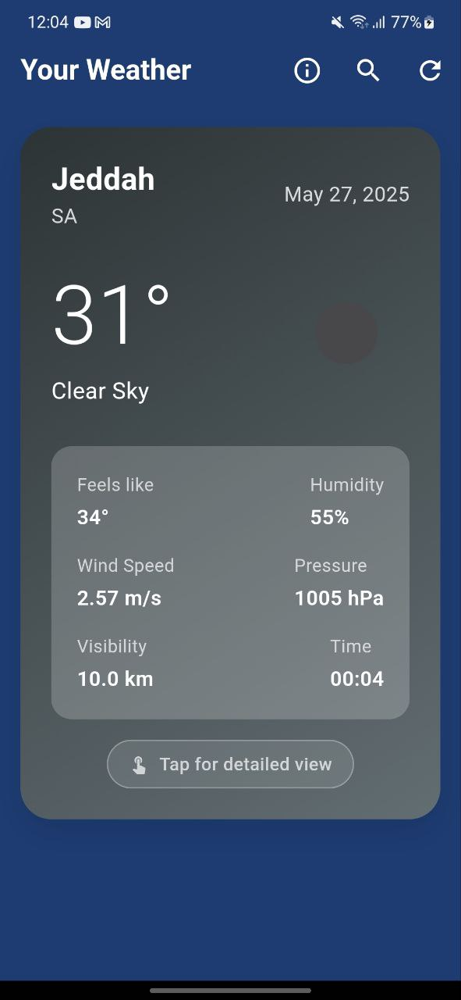
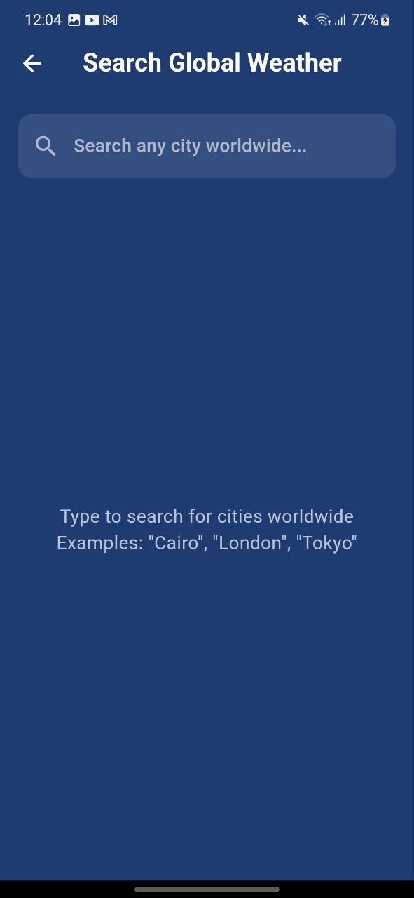
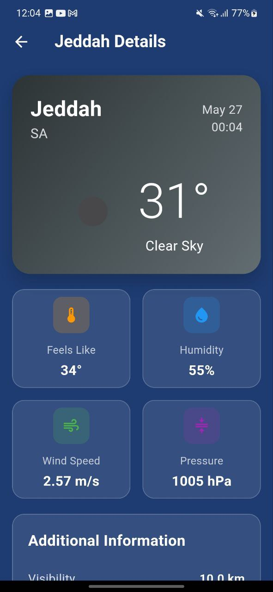

# 🌤️ **Clima** Weather - Flutter Weather Application

A beautiful, modern weather application built with Flutter that provides real-time weather information for any location worldwide.

## ✨ Features

- 🌍 **Global Weather Data** - Get weather information for any city worldwide
- 📍 **Current Location** - Automatic weather detection using GPS
- 🎨 **Beautiful UI** - Modern gradient design with time-based color themes
- 🔍 **Smart Search** - Auto-complete city search with country codes
- 📊 **Detailed Information** - Temperature, humidity, wind speed, pressure, visibility
- 🌙 **Dynamic Themes** - Background changes based on time of day
- 📱 **Responsive Design** - Works perfectly on different screen sizes
- ⚡ **Real-time Updates** - Fresh weather data with pull-to-refresh

## 📱 Screenshots

| Home Screen | Search Screen | Weather Details |
|-------------|--------------|-----------------|
|  |  |  |

## 🚀 Getting Started

### Prerequisites

- Flutter SDK (3.0 or higher)
- Dart SDK (2.17 or higher)
- Android Studio / VS Code
- OpenWeatherMap API Key

### Installation

1. **Clone the repository**
